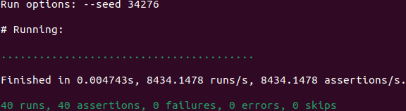

# Credit Card Crypto
> **Name:** Syaheer Altaf (阿爾塔夫)  
*Disclaimer: All Ruby code in this repository has passed `rubocop` formatting checks. Any suggested offenses were corrected immediately.*

## A. Luhn Algorithm
<!-- markdownlint-disable ol-prefix -->

1. Implementation of `luhn_validator.rb` ([see](luhn_validator.rb)):

```ruby
module LuhnValidator
  def validate_checksum
    nums_a = @number.to_s.chars.map(&:to_i)
    checksum = nums_a.pop
    sum = nums_a.reverse_each.with_index.sum do |digit, index|
      digit = digit * 2 - (digit > 4 ? 9 : 0) if index.even?
      digit
    end
    (10 - (sum % 10)) % 10 == checksum
  end
end
```

2. Implementation of `credit_card.rb` (the code snippet necessary for the current week) ([see](credit_card.rb)):
```ruby
class CreditCard
  include LuhnValidator
  attr_accessor :number, :expiration_date, :owner, :credit_network

  def initialize(number, expiration_date, owner, credit_network)
    @number = number
    @expiration_date = expiration_date
    @owner = owner
    @credit_network = credit_network
  end
  def to_json(opts = {})
    {
      number: @number,
      expiration_date: @expiration_date,
      owner: @owner,
      credit_network: @credit_network
    }.to_json(opts)
  end
  def to_s
    to_json
  end
end
```
3. Results from running `bundle exec ruby spec/luhn_spec.rb` and `ruby bench/luhn_bench.rb`:



### Some thoughts for Part A:
The implementation for `luhn_validor.rb` can be further optimized with:
```ruby
module LuhnValidator
  def validate_checksum
    sum = 0
    @number.to_s.chars.reverse.each_with_index do |char, i|
      digit = char.to_i
      digit *= 2 if i.odd?
      digit -= 9 if digit > 9
      sum += digit
    end
    sum % 10 == 0
  end
end
```
and its benchmark:


## B. Substitution and Transposition Ciphers

## C. Advanced Crypto and Hashing

### C.1. ModernSymmetricCipher

### C.2. Hashing
